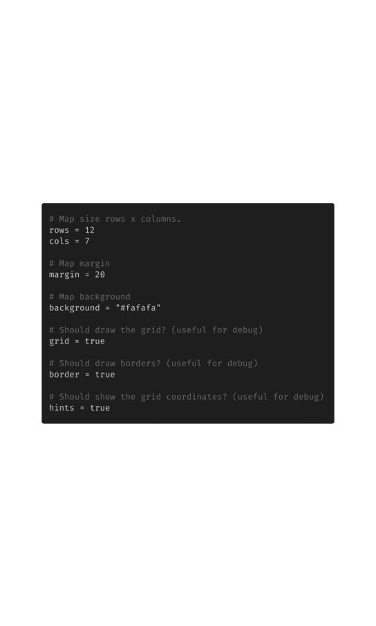

```
   _           _   _
  |_|_ _ _____| |_| |___     
  | | | |     | . | | -_|   
 _| |___|_|_|_|___|_|___|            
|___|
``` 
https://github.com/lucasepe/jumble

> Create (not just) diagrams stitching, connecting  and labelling 
> images on a grid using HCL syntax (like terraform!).

515 Embedded cloud architecture icons! Ready to use!

- 225 AWS icons (uri = assets://aws_[KIND])
- 182 Azure icons (uri = assets://azure_[KIND])
- 108 Google Cloud icons (uri = assets://google_[KIND])

```
# AWS Lambda Authorizer
tile "icon" "lambda1" {
    row = "${subtract(row("agw"), 1)}"
    col = "${subtract(col("agw"), 2)}"
    uri = "assets://aws_lambda"
}
```

- or you can use your local icons (uri = /path/to/my/ic.png)
- or you can use remote icons (uri = http://a.domain.com/img/ic.png)

👉 here an HCL [example](screenshots/sample.hcl)

```bash
./jumble -o sample.png ./screenshots/sample.hcl
```


